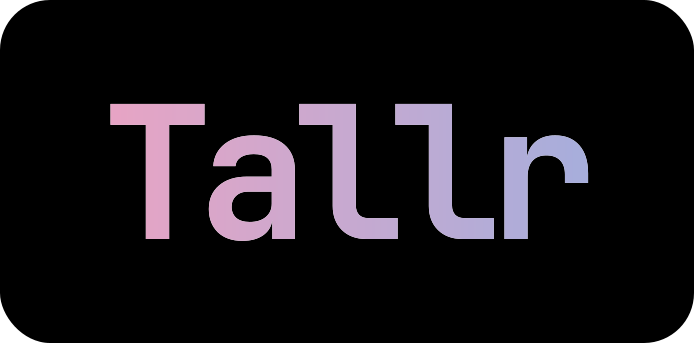

<div align="center" >
  

  [](LICENSE)
  [](https://tauri.app/)
  [](https://reactjs.org/)
  [](https://www.rust-lang.org/)
</div>

## Overview
Tallr is a desktop dashboard for monitoring AI CLI sessions (Claude, Gemini, Codex) with real-time state detection and native notifications. Stay in flow by seeing when your AI is working, waiting, or done - all in a clean, always-on-top window so you can stay in flow without context switching.

<!-- Screenshot placeholder - add dashboard.png when available -->
<!--

-->

> **Author's Note:** This started as a personal tool and learning experience. I'm constantly working to improve it, especially the state detection which I know is buggy (particularly for Codex and Gemini).
My next goal is migrating from pattern recognition to a network-based approach for more accurate state tracking. If you find this useful, I'd love your feedback and patience as we make it better together.

## Installation

### Option 1: Download Release

➡️ https://github.com/kaihochak/tallr/releases

1. Download the latest `.dmg`
2. Open DMG and drag Tallr.app to Applications
3. **Remove quarantine** (required until app is notarized):
   ```bash
   xattr -cr /Applications/Tallr.app
   ```
4. Open Tallr normally

> **Note**: I'm still waiting for Apple Developer Program approval, so the app isn't notarized yet. The `xattr` command removes the quarantine flag that causes the "damaged" error.

### Option 2: Build from Source

**Quick Start**
```bash
npm install
npm run tauri:dev
```

For full development setup, testing, debugging, and contribution guidelines, see [CONTRIBUTING.md](CONTRIBUTING.md).

## Features

- Real-time monitoring of AI CLI sessions  
- Smart notifications when attention is needed  
- Session dashboard with expandable details  
- IDE auto-detection (VS Code, Cursor, Zed, JetBrains, Windsurf, etc.)  
- Always-on-top window and keyboard shortcuts  

## Future Plans

- State detection revamp: move from pattern + hooks to network-based (intercepting API) approach.
- Improve Gemini and Codex state detection accuracy and robustness.
- Incorporate user-suggested enhancements that are useful and attainable.

## Basic Usage

1. Open the Tallr app
2. In your terminal, run:
```bash
tallr claude    # Monitor Claude sessions
tallr gemini    # Monitor Gemini sessions  
tallr codex     # Monitor Codex sessions
```
3. Use your AI tool normally - Tallr tracks the session in real-time

The dashboard shows when your AI is working, waiting, or needs input. You'll get notifications when attention is needed.

**Supported AI tools:** Claude, Gemini, and Codex.

## Configuration

### IDE Detection
Tallr auto-detects your IDE, but some IDEs (like Cursor) are identified as VS Code. To use a specific IDE:

```bash
export TL_IDE=cursor  # or code, zed, webstorm
```

## Links

- 🐛 [Report Issues](https://github.com/kaihochak/tallr/issues)
- 💬 [Discussions](https://github.com/kaihochak/tallr/discussions)
- 🔒 [Security Policy](SECURITY.md)

## Contributing

Tallr started as my personal tool to improve AI development workflows. As more people use it, contributors are encouraged and very much appreciated! 

See [CONTRIBUTING.md](CONTRIBUTING.md) for:
- Development setup and requirements
- Testing and debugging workflows
- Code standards and conventions
- Pull request process

## License

This project is licensed under the MIT License. See the [LICENSE](LICENSE) file for details.
